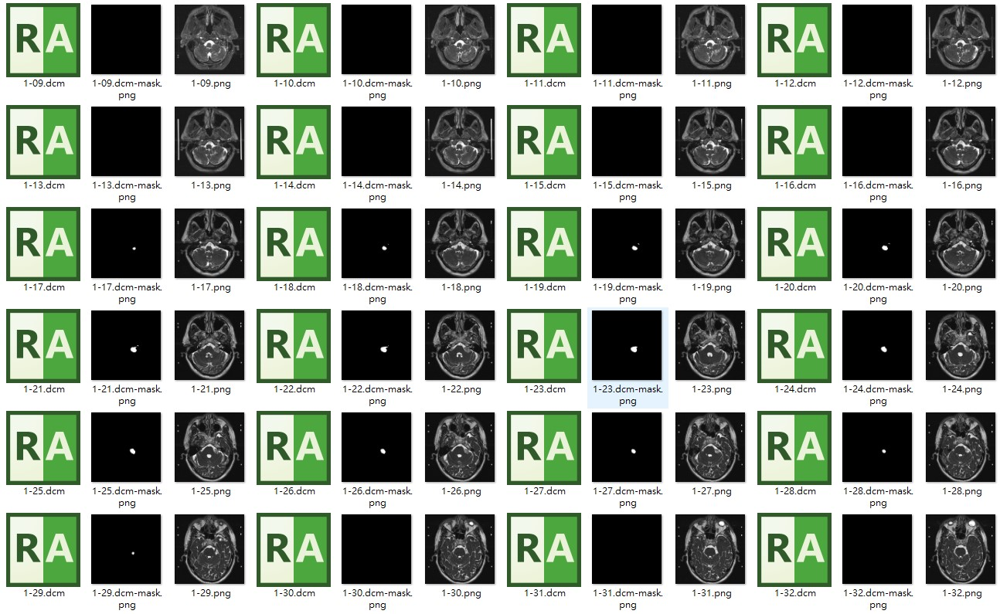

# dump dicom rtss to png
使用 DICOM RTSS 標記檔把對應 DICOM 影像的輪廓匯出成 PNG 檔案

## 必要環境
- JAVA JDK (dcm4che)
    - 用於把 DICOM 影像轉成 PNG 檔
- python
    - 用於把 contour 匯出成 PNG 檔
- node.js
    - 用於匯出 DICOM RTSS 以及 DICOM 檔的對應資訊

## 安裝套件
- 安裝 python 套件
```bash
pip install -r requirements.txt
```

- 安裝 node.js 套件
```bash
npm install
```

## 使用步驟
### Step 1 匯出 DICOM RTSS 以及 DICOM 檔的對應資訊
- 使用以下指令匯出
```bash
node index.js -d dirPath -o xxx.csv
```
- 另外如果您想順便將 DICOM 轉成 PNG 檔案可以加入 `--dcm2img`
```bash
node index.js -d dirPath -o xxx.csv --dcm2img
```

> **Note**
> - 請將 dirPath 轉換成您含有 DICOM 檔案的資料夾路徑
> - 請將 xxx.csv 轉換成您想匯出的 csv 檔案路徑
> - 完成後將會有 `xxx.csv`, `xxx-contour-obj.json`, `xxx-non-contour-obj.json` 檔案

### Step 2 匯出 DICOM RTSS 的 contour PNG
- 使用以下指令匯出
```bash
python dump-contour/index.py -i ./xxx-contour-obj.json -nf ./xxx-non-contour-obj.json
```

> **Note**
> - 請將 xxx-contour-obj.json 以及 xxx-non-contour-obj.json 替換成您上一步驟匯出的 json 檔案名稱

## 產生結果
- 產生結果如下 (含 dcm2img)


